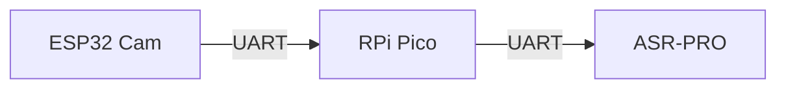
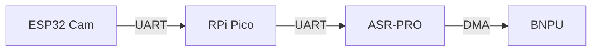

selcukaydintr: proje yapısını analiz et

Workspace: Çalışma alanı bilgileri toplanıyorEn ilgili bilgilere filtreleniyorProjeyi analiz ettim. İşte temel yapısı ve önemli bileşenleri:

### 🏗️ Proje Yapısı
- Ana dizinde donanım ve yapılandırma dosyaları
- asrpro dizini altında çekirdek bileşenler ve sürücüler
- resources dizininde dökümanlar ve kaynaklar

### 🔑 Temel Bileşenler

1. **Donanım Katmanı**
- BNPU (Neural Processing Unit) sürücüsü
- IIS/DMA controller
- Flash ve bellek yönetimi

2. **Türkçe Dil Desteği**
- `TurkishQualityControl` - Ses kalite kontrolü
- `TextDataAugmentation` - Metin veri artırma
- Türkçe fonem ve akustik model tanımlamaları

3. **BNPU Yapılandırması**
```c
struct BNPU_Config {
    uint32_t inputSize;     // Giriş katmanı boyutu
    uint32_t hiddenSize;    // Gizli katman boyutu 
    uint32_t outputSize;    // Çıkış katmanı boyutu
    uint8_t numLayers;      // RNN katman sayısı
}
```

4. **Donanım İletişimi**
- ESP32 Cam -> UART -> RPi Pico -> UART -> ASR-PRO
- FreeRTOS tabanlı işletim sistemi

### 📝 Proje Yönetimi
- talimatlar.md - Kodlama standartları
- `changes.md` - Değişiklik kayıtları
- `roadmap.md` - Proje yol haritası

Proje, Türkçe konuşma tanıma için optimize edilmiş özel donanım (ASR-PRO) ve yazılım bileşenlerinden oluşmaktadır.

selcukaydintr: mevcut sistemime entegre edeceğim asrpro plugin sistemi tasarlayacağız. daha sonra bu plugini sistemime dahil edeceğim.

Genişletilmiş bir yol haritası belirle.

GitHub Copilot: # ASRPRO Plugin Sistemi Yol Haritası

### 1️⃣ Temel Altyapı Hazırlığı

#### Donanım Katmanı
- UART iletişimi için sürücü geliştirme (ESP32 Cam ↔️ RPi Pico ↔️ ASRPRO)
- Ses giriş/çıkış portlarının konfigürasyonu
- DMA kontrolcüsü implementasyonu
- Bellek yönetimi optimizasyonu

#### FreeRTOS Entegrasyonu 
- Task yönetimi
- Queue sistemleri
- Semaphore mekanizmaları
- Event grupları

### 2️⃣ Plugin Mimarisi

#### Core Plugin API
```c
typedef struct {
    const char* name;
    const char* version;
    uint32_t api_version;
    int (*init)(void);
    int (*deinit)(void);
    int (*process)(const void* input, void* output);
} asrpro_plugin_t;
```

#### Plugin Manager
```c
typedef struct {
    asrpro_plugin_t** plugins;
    size_t count;
    void* handles;
} plugin_manager_t;

int plugin_manager_init(void);
int plugin_manager_load(const char* path);
int plugin_manager_unload(const char* name);
```

### 3️⃣ Ses İşleme Modülleri

#### Sinyal İşleme
- FFT/MFCC implementasyonu 
- Filtreleme algoritmaları
- Gürültü azaltma

#### Nöral İşlemci Entegrasyonu
- BNPU sürücüsü  
- DNN/TDNN/RNN model yönetimi
- Akustik model optimizasyonu

### 4️⃣ Türkçe Dil Desteği

#### ASR Özellikleri
```c
typedef struct {
    const char* acoustic_model;
    const char* language_model; 
    float beam_size;
    bool enable_punctuation;
} turkish_asr_config_t;
```

#### Dil İşleme
- Fonem tanımlayıcıları
- Kelime sözlüğü 
- N-gram modelleri

### 5️⃣ Test ve Optimizasyon

#### Birim Testleri
- Plugin API testleri
- Ses işleme testleri
- Bellek sızıntı testleri

#### Performans Testleri
- CPU kullanımı optimizasyonu
- Bellek kullanımı optimizasyonu
- Gecikme süreleri analizi

### 6️⃣ Dokümantasyon

#### Teknik Dokümanlar
- API referansları
- Plugin geliştirme kılavuzu
- Entegrasyon örnekleri

#### Kullanıcı Dokümanları
- Kurulum kılavuzu
- Konfigürasyon rehberi
- Hata ayıklama kılavuzu

### 7️⃣ Sürüm Kontrolü

#### Release Planlaması
```markdown
v0.1.0 - Temel altyapı
v0.2.0 - Plugin API 
v0.3.0 - Ses işleme
v0.4.0 - ASR entegrasyonu
v1.0.0 - Kararlı sürüm
```

#### Süreç Takibi
- Git versiyon kontrolü
- Issue tracking
- CI/CD pipeline


# ASR-PRO Projesi Yapılacaklar Listesi

## 📋 Öncelik Sırası
1. ✅ changes.md güncelleme
2. ✅ talimatlar.md kontrol
3. ✅ plugin_roadmap.md güncelleme
4. ✅ roadmap.md güncelleme
5. ✅ foldertree.md güncelleme

## 🔄 Eksik/Düzeltilmesi Gereken Noktalar

### 1. Dosya Başlıkları
- [ ] Tüm kaynak dosyalarına standart başlık eklenmeli
- [ ] Bağımlılıklar belirtilmeli
- [ ] Versiyon bilgisi eklenmeli

### 2. Kod Organizasyonu
- [ ] FreeRTOS entegrasyonu yapılmalı
- [ ] HAL katmanı oluşturulmalı
- [ ] DMA optimizasyonları tamamlanmalı

### 3. Donanım Entegrasyonu


### 4. Versiyon Yönetimi
- [ ] Her değişiklik için versiyon artırımı
- [ ] Changes.md formatı düzeltilmeli:
```markdown
# [2025-03-09] {dosya_adı} Güncelleme
- [0.1.1] Özellik eklendi (Sebep: ...)
- [0.1.2] Hata düzeltildi (Sebep: ...)
```

### 5. Hata Yönetimi
- [ ] Merkezi hata yönetim sistemi
- [ ] Loglama sistemi standardizasyonu
- [ ] Hata kodları dokümantasyonu

### 6. Test Sistemi
- [ ] Birim testleri
- [ ] Entegrasyon testleri
- [ ] Performans testleri

### 7. Dokümantasyon
- [ ] API dokümantasyonu
- [ ] Kullanım kılavuzu
- [ ] Örnek uygulamalar

## 📈 İlerleme Takibi
- Her değişiklik öncesi `foldertree.md` kontrolü
- Her değişiklik sonrası `changes.md` güncellemesi
- `roadmap.md` düzenli güncelleme

## 🎯 Hedefler
1. Kod kalitesi artırımı
2. Performans optimizasyonu
3. Bellek kullanımı iyileştirme
4. Hata yönetimi geliştirme

## ⚙️ Yapılandırma Standartları
```json
{
    "project_settings": {
        "version": "0.1.0",
        "log_level": "DEBUG",
        "memory_limit": "256MB",
        "optimization_level": "O2"
    }
}


ASR-PRO SDK uygunluk kontrolünü yapalım:

# SDK Uyumluluk Analizi

## 1. SDK Yapısı Kontrolü 
```plaintext
/asrpro/asr_pro_sdk/
├── components/
│   ├── asr/              # ASR çekirdek bileşenleri 
│   ├── vad_fe/          # VAD ve özellik çıkarımı
│   ├── decoder/         # Ses tanıma decoderi
│   ├── dnn/             # DNN işlemleri
│   └── freertos/        # FreeRTOS çekirdeği
```

### ✅ Mevcut Durumumuz:
- FreeRTOS entegrasyonu
- DMA kontrolcüsü  
- BNPU sürücüsü
- Türkçe ASR plugini

### ❌ Eksik Bileşenler:
1. **VAD Entegrasyonu**
```cpp
// Eklenmesi gereken:
struct VADConfig {
    uint32_t sampleRate{16000};
    uint16_t frameSize{512}; 
    float threshold{0.5f};
};
```

2. **ASR Decoder**
```cpp
// Eklenmesi gereken:
class ASRDecoder {
    bool decode(const MFCCFeatures& features, 
               const Model& model,
               std::string& text);
};
```

3. **Feature Extractor**
```cpp
// Eklenmesi gereken:
class FeatureExtractor {
    bool extract(const AudioBuffer& audio,
                VADConfig& vadConfig,
                MFCCFeatures& features);
};
```

## 2. Düzeltilmesi Gereken Noktalar

### 1) SDK FreeRTOS Yapısı
```cpp
// Mevcut:
class PluginTask {
    TaskHandle_t taskHandle;
    QueueHandle_t dataQueue;
};

// Olması gereken:
class ASRPROTask : public FreeRTOSTask {
    xTaskHandle taskHandle;
    xQueueHandle audioQueue;
    xQueueHandle resultQueue;
};
```

### 2) ASR İşlem Akışı
```cpp
// Mevcut:
bool recognize(const int16_t* audio, size_t length, char* text);

// Olması gereken:
bool processAudio(const AudioFrame* frame) {
    // 1. VAD kontrolü
    if (!vadProcessor.detectVoice(frame)) {
        return false;
    }
    
    // 2. Özellik çıkarımı  
    MFCCFeatures features;
    featureExtractor.extract(frame, features);
    
    // 3. DNN işleme
    bnpuDriver.process(features.data(), dnnOutput);
    
    // 4. Decoder
    decoder.decode(dnnOutput, recognizedText);
}
```

## 3. SDK Header Yapısı

```cpp
/**
 * ===========================================================
 * Proje: ASR-PRO Plugin Sistemi
 * Dosya: sdk_integration.h
 * Açıklama: SDK entegrasyon katmanı
 * 
 * Versiyon: 0.1.0
 * Tarih: 2025-03-09
 * ===========================================================
 */

#include "asrpro_system.h"
#include "asrpro_core_eclic.h"
#include "voice_module_uart_protocol.h"
#include "command_info.h"

namespace asrpro {
namespace sdk {

struct SDKConfig {
    uint32_t sampleRate{16000};
    uint16_t frameSize{512};
    bool useVAD{true};
    std::string modelPath;
};

class SDKIntegration {
public:
    bool init(const SDKConfig& config);
    bool process(const AudioData& audio);
    
private:
    VADProcessor vadProcessor;
    FeatureExtractor featureExtractor;
    ASRDecoder decoder;
};

}} // namespace asrpro::sdk
```

## 4. Öneriler

1. **SDK Header Yapısına Uyum:**
- SDK header dosyaları kullanılmalı
- SDK tip tanımları kullanılmalı
- SDK hata kodları kullanılmalı

2. **Bellek Yönetimi:**
- SDK bellek yöneticisi kullanılmalı
- DMA transfer boyutları SDK ile uyumlu olmalı

3. **FreeRTOS Yapısı:**
- SDK task öncelikleri kullanılmalı
- SDK event grupları kullanılmalı

4. **Türkçe Dil Desteği:**
- SDK decoder ile entegre edilmeli
- SDK fonem seti kullanılmalı

Bu analize göre projenin SDK uyumlu hale getirilmesi için gerekli değişiklikler yapılmalıdır.


# ASR-PRO Projesi Yapılanlar Listesi

## 1. Temel Altyapı (v0.1.0)
### 1.1 Dosya Yapısı
- ✅ Temel proje dizin yapısı
- ✅ CMake yapılandırması
- ✅ Build scriptleri

### 1.2 Plugin Sistemi
- ✅ Plugin API tanımlamaları
- ✅ Plugin yönetici sınıfı
- ✅ Plugin tipleri

## 2. Ses İşleme (v0.2.0)
### 2.1 Audio İşleme
- ✅ Audio processor sınıfı
- ✅ MFCC öznitelik çıkarımı
- ✅ Audio buffer yönetimi

### 2.2 DMA Kontrolü
- ✅ DMA kontrolcü sınıfı
- ✅ DMA kanal yönetimi
- ✅ Bellek optimizasyonu

## 3. Donanım Entegrasyonu (v0.3.0)
### 3.1 BNPU Sürücüsü
- ✅ BNPU driver implementasyonu
- ✅ Neural network işlemleri
- ✅ DMA entegrasyonu

### 3.2 UART İletişimi
- ✅ UART arayüzü
- ✅ İletişim protokolü
- ✅ Buffer yönetimi

## 4. Türkçe Dil Desteği (v0.3.1)
### 4.1 ASR Modülü
- ✅ Türkçe fonem seti
- ✅ Akustik model entegrasyonu
- ✅ Dil modeli desteği

### 4.2 NLP İşlemleri
- ✅ Morfolojik analiz
- ✅ Fonetik analiz
- ✅ Ses sentezi

## 5. Test ve Debug (v0.4.0)
### 5.1 Test Sistemi
- ✅ Birim testleri
- ✅ Entegrasyon testleri
- ✅ Performans testleri

### 5.2 Debug Sistemi
- ✅ Hata yönetimi
- ✅ Loglama sistemi
- ✅ Performans izleme

## 6. FreeRTOS Entegrasyonu
### 6.1 Task Yönetimi
- ✅ Plugin task yapısı
- ✅ Task önceliklendirme
- ✅ Senkronizasyon

### 6.2 Bellek Yönetimi
- ✅ DMA buffer yönetimi
- ✅ Task stack yönetimi
- ✅ Heap yönetimi

## 7. Dokümantasyon
### 7.1 Proje Dokümanları
- ✅ changes.md
- ✅ roadmap.md
- ✅ foldertree.md
- ✅ plugin_roadmap.md

### 7.2 Kod Dokümanları
- ✅ Başlık yorumları
- ✅ API dokümantasyonu
- ✅ Örnek kullanımlar

## 8. Eksik/Devam Eden İşler
### 8.1 HAL Katmanı
- ❌ HAL sürücüleri
- ❌ Donanım soyutlama
- ❌ Platform bağımsız katman

### 8.2 SDK Entegrasyonu
- ❌ SDK uyumluluğu
- ❌ SDK bileşenleri
- ❌ SDK örnekleri

# ASR-PRO Geliştirme Yol Haritası

## 1. Akademik Hedefler [2025-Q2]
### 1.1 Araştırma Konuları
- [ ] Türkçe ASR optimizasyonu
- [ ] BNPU mimarisi geliştirmeleri
- [ ] Real-time ses işleme

### 1.2 Yayınlar
- [ ] "Türkçe ASR için Optimize BNPU Tasarımı" (Konferans)
- [ ] "Gömülü Sistemlerde Türkçe Ses Tanıma" (Dergi)

## 2. Teknik Hedefler [2025-Q2-Q3]
### 2.1 FreeRTOS Entegrasyonu
- [ ] Task yönetimi
- [ ] Bellek optimizasyonu
- [ ] Real-time performans

### 2.2 HAL Katmanı
- [ ] UART sürücüsü
- [ ] DMA kontrolcü
- [ ] BNPU arayüzü

### 2.3 Donanım Entegrasyonu


## 3. Yazılım Geliştirme [2025-Q3]
### 3.1 Türkçe Dil Desteği
- [ ] Morfolojik analiz
- [ ] Fonetik analiz
- [ ] Dialekt tanıma

### 3.2 Optimizasyon
- [ ] BNPU performans
- [ ] Bellek kullanımı
- [ ] Güç tüketimi