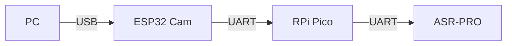

ASR-PRO modülüne yükleme işlemi için gereken adımları talimatlar doğrultusunda açıklayalım:

# ASR-PRO Modül Yükleme Kılavuzu

## 1. Proje Yapısı Kontrolü

```markdown
/asrpro/
├── firmware/
│   ├── release/
│   │   └── asrpro_v0.5.0.bin    # Firmware dosyası
│   └── debug/
│       └── asrpro_debug.bin
├── tools/
│   └── flash_tool/              # Yükleme aracı
└── scripts/
    └── upload.bat               # Windows yükleme scripti
```

## 2. Yükleme Adımları

### 2.1. Donanım Bağlantısı


### 2.2. Yükleme Scripti
```batch
@echo off
echo ASR-PRO Firmware Yükleme Aracı
echo ============================

:: Port kontrolü
set COM_PORT=COM3
mode %COM_PORT% baud=115200 parity=n data=8 stop=1

:: Yükleme sırası
echo 1. ESP32 Cam yükleniyor...
esptool.py --port %COM_PORT% write_flash 0x0000 ../firmware/release/esp32_v0.5.0.bin

echo 2. RPi Pico yükleniyor...
picotool load -f ../firmware/release/pico_v0.5.0.uf2

echo 3. ASR-PRO yükleniyor...
asrpro-tool --port %COM_PORT% --flash ../firmware/release/asrpro_v0.5.0.bin

echo Yükleme tamamlandı!
```

### 2.3. Yükleme Yapılandırması

```json
{
    "firmware": {
        "esp32": {
            "baud_rate": 115200,
            "flash_mode": "dio",
            "flash_size": "4MB"
        },
        "rpi_pico": {
            "interface": "picoprobe",
            "target": "rp2040"
        },
        "asrpro": {
            "protocol": "uart",
            "baud_rate": 115200,
            "chunk_size": 4096
        }
    },
    "verification": {
        "check_crc": true,
        "verify_flash": true
    }
}
```

## 3. Güvenlik Kontrolleri

```cpp
bool verifyFirmware(const uint8_t* firmware, size_t size) {
    // CRC kontrolü
    uint32_t crc = calculateCRC32(firmware, size);
    if (crc != EXPECTED_CRC) {
        LOG_ERROR("Firmware CRC kontrolü başarısız", "SecurityCheck");
        return false;
    }
    
    // Versiyon kontrolü
    FirmwareHeader* header = (FirmwareHeader*)firmware;
    if (header->version < MINIMUM_VERSION) {
        LOG_ERROR("Firmware versiyonu çok eski", "SecurityCheck");
        return false;
    }
    
    return true;
}
```

## 4. Yükleme Sonrası Kontroller

```cpp
bool performPostUploadChecks() {
    // 1. UART bağlantısı kontrolü
    if (!checkUARTConnection()) return false;
    
    // 2. DMA kontrolü
    if (!verifyDMAOperation()) return false;
    
    // 3. BNPU kontrolü
    if (!testBNPUOperation()) return false;
    
    // 4. Türkçe ASR testi
    return verifyTurkishASR();
}
```

## 5. Yükleme Talimatları

1. Donanım bağlantılarını yapın
2. Gerekli araçları yükleyin:
   - `esptool.py` (ESP32 için)
   - `picotool` (RPi Pico için)
   - `asrpro-tool` (ASR-PRO için)
3. `upload.bat` scriptini çalıştırın
4. Yükleme sonrası kontrolleri bekleyin

## 6. Hata Durumları

| Hata Kodu | Açıklama | Çözüm |
|-----------|----------|--------|
| E001 | UART bağlantı hatası | Kabloları kontrol edin |
| E002 | CRC doğrulama hatası | Firmware dosyasını yeniden indirin |
| E003 | DMA hatası | Bellek ayarlarını kontrol edin |
| E004 | BNPU hatası | Güç kaynağını kontrol edin |

Devam etmek için talimat verebilirsiniz.